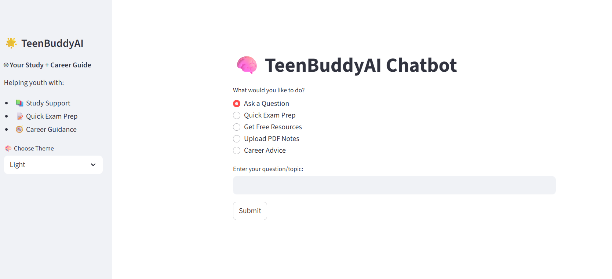
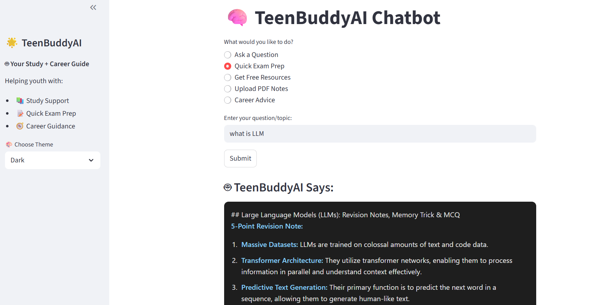

<h1 align="center">🤖 TeenBuddyAI</h1>

 Your Friendly Study & Career Guide — Powered by Streamlit + Gemini API

  
  
  

---

## 🎯 What is TeenBuddyAI?

TeenBuddyAI is a friendly, interactive chatbot designed to help **teenagers aged 13–19** with:

- 📚 Study doubts & exam prep  
- 🧭 Career guidance  
- 🎓 College or subject decisions  
- 📄 Understanding uploaded notes  

It combines **AI-powered answers**, **PDF summarization**, **resource links**, and a **clean dark/light theme**, all through an approachable and easy-to-use UI.

---

## ✨ Features

| Feature | Description |
|--------|-------------|
| 💬 **Ask Anything** | Type any study or career-related query |
| 📑 **Upload PDF Notes** | Get summaries and auto-generated MCQs |
| ⚡ **Quick Exam Prep** | 5-point revision notes + memory trick + quiz |
| 🔗 **Get Resources** | Links to YouTube, Khan Academy, BYJU’S, etc. |
| 🌗 **Dark/Light Mode** | Switch instantly from the sidebar |
| 🔐 **API Key Privacy** | Your Gemini key stays private – not stored |

---
### 📸 Chat Response

   &nbsp;
  

#### Thank You, This is your TeenBuddy !!
